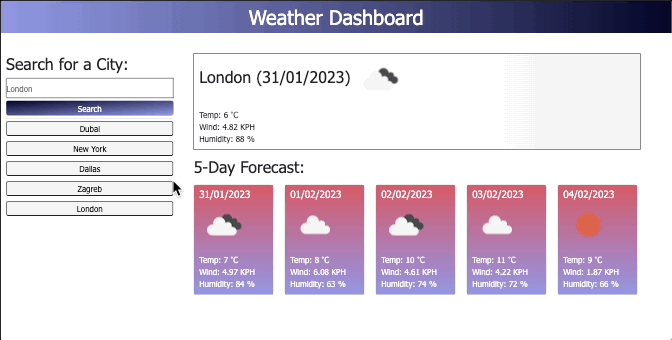

# Weather Dashboard (Server APIs)

## Table of contents

- [Overview](#overview)
- [Acceptance Criteria](#acceptance-criteria)
- [Application Demo](#application-demo)
- [Links](#links)
- [Built with](#built-with)
- [What I learned](#what-i-learned)
- [Future Development](#future-development)
- [Useful resources](#useful-resources)
- [Author](#author)
- [Acknowledgements](#acknowledgements)

## Overview

- This application was built to consolidate Server APIs knowledge;

  - A weather dashboard that runs in the browser and features dynamically updated HTML and CSS

- [5 Day Weather Forecast](https://openweathermap.org/forecast5) was used to retrieve weather data for cities

## Acceptance Criteria

The app functionality:

- When a user searches for a city they are presented with current and future conditions for that city and that city is added to the search history

- When a user views the current weather conditions for that city they are presented with:

  - The city name
  - The date
  - An icon representation of weather conditions
  - The temperature
  - The humidity
  - The wind speed

- When a user views future weather conditions for that city they are presented with a 5-day forecast that displays:

  - The date
  - An icon representation of weather conditions
  - The temperature
  - The humidity

- When a user clicks on a city in the search history they are again presented with current and future conditions for that city

#### Technical Acceptance Criteria

- Satisfies all the above, plus the following:

  - Uses the OpenWeather API to retrieve weather data.

  - Uses `localStorage` to store persistent data.

## Application Demo

The following animation demonstrates the application functionality:

## Links

- You will be able to acces the app URL if you navigate into Settings → Pages inside this repository

- Or, click on this link: [Weather Dashboard](https://cyberrie.github.io/Weather-Dashboard/)

## Built with...

- HTML

- CSS

- JavaScript

- Moment.js

- Server APIs

## What I learned

- Accessing the data from a backend server (access to information stored in databases) and fetch it on-demand to update my apps

- The concept of server-side APIs and the use of AJAX queries to retrieve and parse data in the JSON format;

  - Access data on RESTful web APIs using AJAX calls
  - Understand and utilize the concept and utility of APIs and JSON in web applications
  - Build endpoint URLs to a variety of APIs
  - Worked with the OMDb and Giphy APIs to build data-rich applications
  - Process returned data to isolate key elements that you'll use with JavaScript logic
  - Generate page elements based on API responses

#### Toughest climb?

- The most challenging part of this project was correctly accessing desired data by building endpoint URLs

- The key message is to always read the Docs and test the data before proceeding further

## Future Development

- Specify to the user, that the city data has to be written with a capital letter

## Useful Resources

- [OpenWeather API](https://openweathermap.org/api)

- [Fetching data from the server](https://developer.mozilla.org/en-US/docs/Learn/JavaScript/Client-side_web_APIs/Fetching_data)

- [JavaScript Promise](https://developer.mozilla.org/en-US/docs/Web/JavaScript/Reference/Global_Objects/Promise)

## Author

©️ 2023 Helena Gilja. All Rights Reserved.

- GitHub - [cyberrie](https://github.com/cyberrie)

## Acknowledgements

✨ Big thanks to my tutor Dane for answering all my questions during this project! ✨
